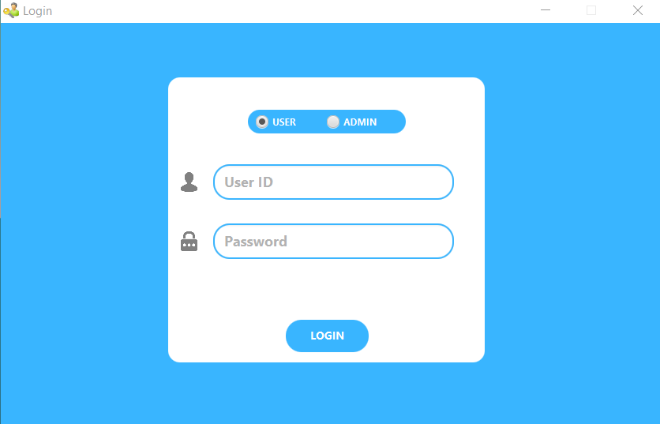
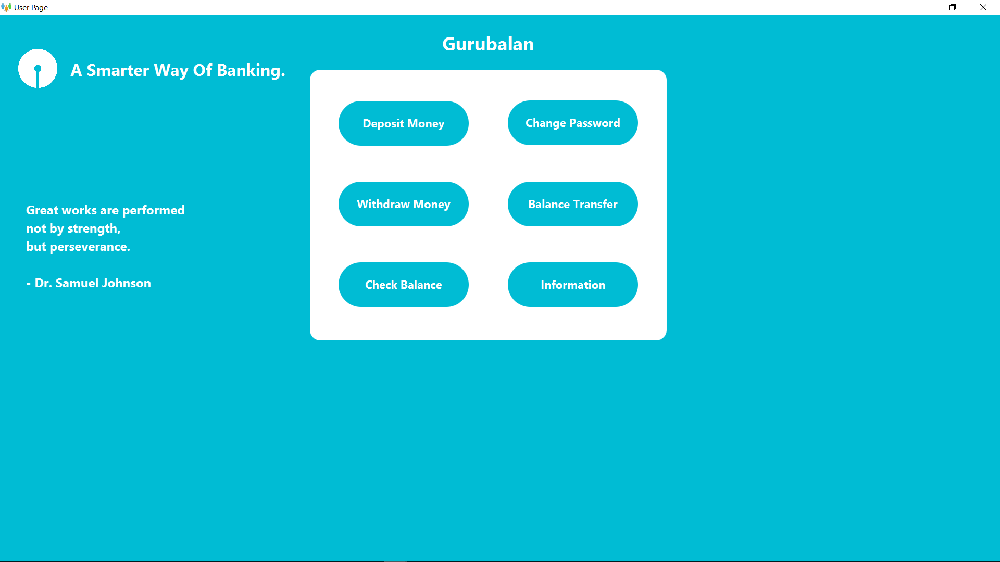
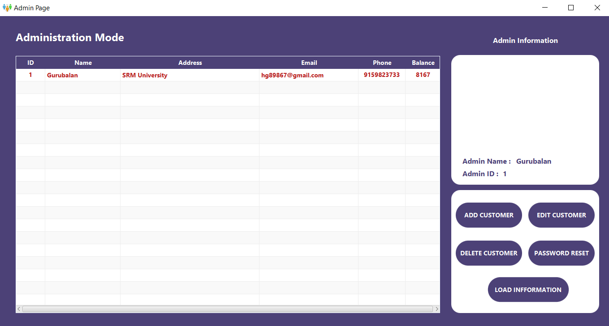
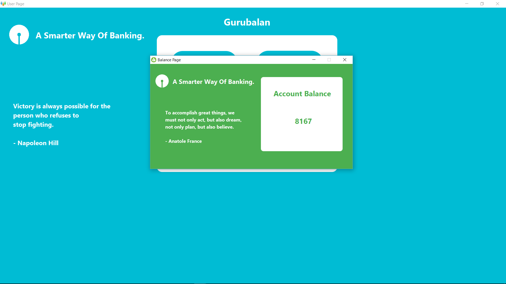
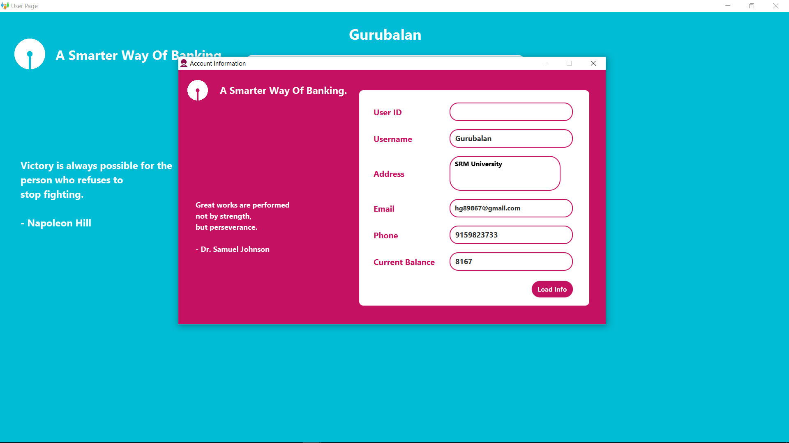

# Bank Account Simulation.  
This is a robust software made with **Java**, **JavaFX** and **SQLite** database as backend. It contains all the features of banking applications with 
material UI and UX. To look at the **SQLite** database file: [Click here](src/main/resources/db).

## Sqlite 3.
To get started off, first to execute tables and SQLite commands you need to install `Sqlite3`. Head over [here](https://www.sqlite.org/2018/sqlite-tools-win32-x86-3220000.zip) (WindowsOS) for downloading it.Then you can execute and create tables within the commandline.
### Alternative:
The alternative GUI experience is the `Sqlite DB browser`.[Click here](http://sqlitebrowser.org/) to download. 

## Material Design.
Every design structure and UI implemented here is according to the guidelines of [Google Design](https://design.google/) precisely [Material Design](https://material.io/).
Includes smooth transitions and other minor UI tweaks with a rich dashboard UI. 

## Content
- Java
- JavaFX
- Sqlite3
- FXML
- CSS-Stylesheets

## License
This software is copyrighted and hence licensed.[View here](LICENSE).

## Screensots
    

_Thank you for stopping by._
